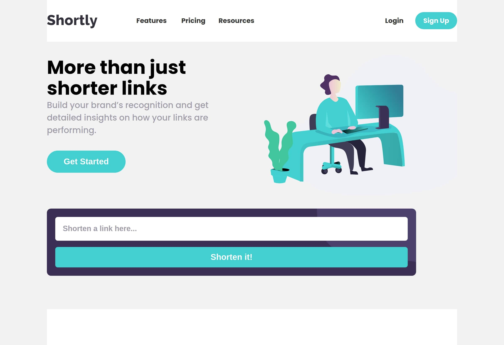

# Frontend Mentor - Shortly URL shortening API Challenge solution

This is a solution to the [Shortly URL shortening API Challenge challenge on Frontend Mentor](https://www.frontendmentor.io/challenges/url-shortening-api-landing-page-2ce3ob-G). Frontend Mentor challenges help you improve your coding skills by building realistic projects. 

## Table of contents

- [Overview](#overview)
  - [The challenge](#the-challenge)
  - [Screenshot](#screenshot)
  - [Links](#links)
- [My process](#my-process)
  - [Built with](#built-with)
  - [What I learned](#what-i-learned)
  - [Continued development](#continued-development)
  - [Useful resources](#useful-resources)
- [Author](#author)
- [Acknowledgments](#acknowledgments)

## Overview

### The challenge

Users should be able to:

- View the optimal layout for the site depending on their device's screen size
- Shorten any valid URL
- See a list of their shortened links, even after refreshing the browser
- Copy the shortened link to their clipboard in a single click
- Receive an error message when the `form` is submitted if:
  - The `input` field is empty
  - Something went wrong trying to short the url

### Screenshot

### Links

- Solution URL: [https://github.com/tadeubdev/shortly-frontend-mentor](https://github.com/tadeubdev/shortly-frontend-mentor)
- Live Site URL: [https://tadeubdev.github.io/shortly-frontend-mentor/](https://tadeubdev.github.io/shortly-frontend-mentor/)

## My process

### Built with

- Semantic HTML5 markup
- CSS custom properties
- Flexbox
- CSS Grid
- Mobile-first workflow
- Vanilla JS

## Author

- Website - [Tadeu Barbosa](https://github.com/tadeubdev)
- Frontend Mentor - [@tadeubdev](https://www.frontendmentor.io/profile/tadeubdev)
- Twitter - [@tadeubdev](https://www.twitter.com/tadeubdev)
- Dev.to - [@tadeubdev](https://dev.to/tadeubdev)
